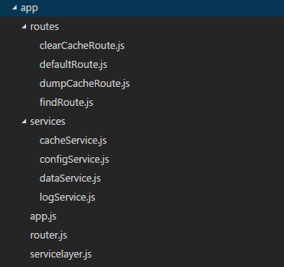
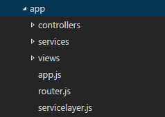

#The Simple Service Layer Architecture for Node Express applications (SSLA).
Express is a small framework giving developers at lot of freedom and decisions to make regarding how to structure 
an Express application. This is in contrast to larger frameworks like ASP.Net MVC and Ruby on Rails,
which are much more prescriptive regarding how to structure an application, 

Even though the SSLA is similar to the default Node Express App scaffolded from express, it is inspirred by the SOLID 
design principles and the way I structure .Net applications, where I also use a notion of a service layer.   

The Simple Service Layer Architecture structures application code so that it is

- simple  
- has no implicit code (like auto registration of dependencies)
- modular and loosely coupled with dependency injection

The benefits of this approach are:

- Simple code is easy to read, understand and reason about, which is very important for long lived codebases.
- Avoiding implicit code minimises makes it easier to read from the code what actually happens at runtime. Implicit behaviour 
may seem very smart and be short to write, but it can also make the code harder to follow and understand later on. 
- A simple and well defined architecture makes it easier to onboard new team members, especially less experienced developers.
- Modular and loosely coupled code with dependency injection ensures that the code is extensible, testable and maintainable,
which is important for long live code bases.

A primary focus is to keep the code simple and avoid the bad parts of Javascript. No classical or prototypal inheritance 
patterns are used and nor is the new and this keywords used. The code simply uses objects, functions, closures and 
modules in very straightforward manners, which avoids many of the quirks of Javascript.

##Modules with dependency injection
The application code should be modular, by using many small modules that each does only one thing/has limited 
responsibility. 

A module is a single file, assigning a function to the *module.exports* object called the module function.
Dependencies are injected into modules as parameters to the module function. This is primarily used in the 
service modules of the service layer described below, and the route handlers (which sometimes are called 
controllers).

Modules will typically be singletons, meaning that only a single instance of the module will created in the application.
Singleton modules are a good fit for Node, because Node processes are single threaded. In multithreaded code, singletons lead 
to concerns about conccurent access to shared singleton state.

Another benfit of singletons is that fewer objects will be allocated, leading to lower memory pressure and fewer garbage collections, which otherwise could lead to performance problems.

Singletons modules are also conceptually simple, less prone to memory leaks and they can all be explicitly wired up at application start, which 
provides an easy overview of the entire application logic.

###Loose coupling
By injecting modules into the module function of other modules, the modules become loosely coupled, and individual dependencies 
can easily be mocked out in test code.
Dependencies are injected in a module by passing other module instances as parameters to the module function. 

##Service Layer
Central to SSLA is the notion of a "Service Layer". The service layer is a collection of Node modules placed in the 
services folders. A service will often depend on other services, and dependencies are injected
into a service by calling the module function of the service passing in all required dependencies.

At runtime, all of the instantiated services with all of their injected dependencies is called the service layer, 
and it is created at application start by a factory module. 

The Dependency injection and creation is made manually in the servicelayer.js module, which has the responsibility of 
creating each service with and injected depedencies (other services) na "createServiceLayer" function in the factory module. This makes
it possible to follow exactly what is happening at startup, comparted to more implicit approaches like automatic IOC containers.

The service layer contains the application logic, and provide a means to separate logic from the details of handling and 
routing HTTP requests. The route middlewares (controllers) will have services injected, and use these to access and 
call application logic.

Be separating application logic into services, it becomes possible to test the application logic in isolation.  

Note that services are created as singletons, meaning that only a single instance of each service is created for 
the entire application. This is not a problem in a single threaded Node process, and helps avoiding memory leaks,
because services objects are only created once in a well defined way in the servicelayer module.

###What is a service
A service is simply a Javascript object that exposes a number of functions. The service is created by calling the function
exported from the module that contains the service. 

Modules should have a single responsibility, and most application logic can be created as a service, for example:

- configuration service
- cache service
- a service for database access
- a service for each remote api 
 
##Routes with dependency injected services
Routes form the API and entry points of the application. Each route is handled by a module which have a 
module function that returns an express middleware/route function. Each of the route modules are  
initialized and dependency injected by a simple router module, which simply loads and calls each router module
with required dependencies and then installs the returned middleware function as a route using a standard Express router. 

#Minimal example application using SSLA
The app folder contains a minimal example application using SSLA and no views and no view engine.
This somewhat contrived application is suitable for showing the mechanisms of SSLA, 
but still kept very simple and limited in scope. 

This app has 4 routes:

- `/` : The root path showing some instructions.
- `/find/:key` : Simulates finding data from a data service. The data service simulates data by 
taking current time. The :key parameter is simply used as cache key. So if `:key` exists in the cache, 
then the cached data is returned, otherwise data is generated by taking the current time and caching it and
returning it.
- `/dumpcache` : Used to inspect the contents of the cache, which are dumped as json.
- `/clearcache` : Used to clear the cache. 

The app has 4 services:
- a configuration service
- a log service, which depends on the configuration service.
- a cache service, which depends on the log and configuration services.
- a data service, which depends on the cache, log and configuration services

Here is the structure of the root folder of the application:



An alternative app which also has views and view engine could look like this, where `controllers` is used
as an alternative folder name for the `routes` folder:



##app.js file
This is the start file of the application where the express framework is configured and the server is started.
This file is similar to the standard scaffolded app.js file in a project scaffolded with `express init`.
###Example
This is a simple example without cookie handling, body-parser, view and view engine:
```js
'use strict';
const express = require('express');
const services = require('./servicelayer')('./services');
const router = require('./router.js')("./routes/",services);
const app = express();
app.use(router);
const server = app.listen(services.config.port,()=>{
    services.log.info("*********************************");
    services.log.info("* App listening on port " + server.address().port);
    services.log.info("*********************************");
});
```
Notice how the service layer is first created and assigned to the `service` variable.
The `router` is then created with the service layer as second parameter, giving the
router module access to all services in the service layer, so that they can be used
for dependency injecting in the route modules/controllers.
The app.js file does also use the service layer directly:
- The server uses `services.config.port`.
- Logging is done using `services.log.info`. 

##servicelayer.js file
This module is responsible for creating services and return the service layer as an
object. The services are creating using manual and explicit dependency injection,
so that it is clear from the code what exectly is injected, and it is possible
to debug this bootstrapping process. 
###Example
```js
'use strict';
module.exports = (dir) => {
    const config = require(dir + '/configService')();
    const log = require(dir + '/logService')(config);
    const cache = require(dir + '/cacheService')(log, config);
    const data = require(dir + '/dataService')(cache, log, config);
    return {
        config,
        log,
        cache,
        data
    };
}
```
- `config` is created with no dependencies, because the module function is called without arguments.
- `log` is created with the config service as dependency, because logging needs to read config settings.
- `cache` is created with the config a
nd log services as dependencies, because the cache module needs both read config settings and log various stuff.
- `data` is a service that abstracts some database, and it uses cache, log and config as dependencies. Caching because it optimizes performance by using a cache.

Finally an object exposing services is returned. This object is called the servicelayer. 

##router.js file 
Routing is handled by creating a standard express router with router middleware functions.
The middleware functions are returned from module functions, to allow injecting services
into the route handling middleware, described earlier.  
###Example
```js
'use strict';
module.exports = (dir,s) => {//s is the services layer.
    const router = require('express').Router();
    router.get('/', require(dir + 'defaultRoute.js')());
    router.get('/find/:key',require(dir + 'findRoute.js')(s.data));
    router.get('/clearcache',require(dir + 'clearCacheRoute.js')(s.cache,s.log));
    router.get('/dumpcache',require(dir + 'dumpCacheRoute.js')(s.cache));
    return router;    
}  
```

##Services
As an example the data service is shown, to demonstrate how it uses the injected dependencies config, log and cache:
###dataService.js
```js
'use strict';
module.exports = (cache, log, config) => {
    return {
        getData: (key) => {
            log.debug("calling getData with key " + key);
            if(key === 'illegal key') {
                log.error('illegal key');
                return null;
            }
            let result = config.useCache ? cache.get(key) : null;
            if (!result) {
                result = new Date();
                cache.set(key, result);
            }
            return result;
        }
    }
}
```
Notice how the config, log and cache services are all used. 
The code for the other services can be found in the repo.

##Routes
As was seen above, the router module loads each route as a module and injects
any needed dependencies. 
###Example
The `clearCacheRoute` module has two dependencies:
```js
//clearCacheRoute.js:
'use strict';
module.exports = (cache, log) => {
    return (req,res) => { 
        cache.clear();
        const msg = "Cache cleared.";
        log.info(msg);
        res.send(msg);     
    };
};
```
As shown earlier, these two dependencies were injected at application startup
in the `router.js` module:

```js
router.get('/clearcache',require(dir + 'clearCacheRoute.js')(services.cache,services.log));
```

#Summing up
The SSLA provides a way to creating maintainable and testable
applications. Once this number services and routes grows, one can simply create sub 
folders in the services and routes folders as neccessary.

#TODO:
- show how to write unit test, and isolate services in unit tests.
